目标分类检测教程

这是牛津大学视觉组的计算机视觉实验教程，版权归 Andrea Vedaldi and Andrew Zisserman 所有。(Release 2014a).


目标分类检测的任务是发现和定位给定图片中的物体。 示例应用包括行人检测、车辆检测、交通信号检测以及网络图像上感兴趣的工具或者动物等。给定目标类别，比如说人，检测器接收图像并且产生一个、0个或者多个目标在图像中的包围框。主要的挑战在于检测器需要找到物体不管他们是否有平移或者尺度的缩放以及姿态的变化还有其他因素的影响，比如服装、光照或者着遮挡等。

这个教程探索了视觉目标检测的基本技术，特别是基于图像的模型。目标图的表观片通过统计方法学习得到。然后，为了检测图片中的物体，这个统计模型被用到从图片提取的所有可能的位置和尺度上，然后决定是否有一个窗口包含目标物体。


更细一点的说，这个教程包含以下几个话题：(i) 使用HOG特征描述图片区域, (ii) 构造一个基于HOG特征的滑窗家车企来定位图片中的物体; (iii) 处理多尺度和多目标的情况; (iv) 使用线性分类器学习目标的表观; (v) 使用平均准确率评估学习到的模型; (vi) 使用难例挖掘学习目标检测器.


Object category detection practical
Getting started
Part 1: Detection fundamentals
Step 1.0: Loading the training data
Step 1.1: Visualize the training images
Step 1.2: Extract HOG features from the training images
Step 1.3: Learn a simple HOG template model
Step 1.4: Apply the model to a test image
Step 1.5: Extract the top detection
Part 2: Multiple scales and learning with an SVM
Step 2.1: Multi-scale detection
Step 2.2: Collect positive and negative training data
Step 2.3: Learn a model with an SVM
Step 2.4: Evaluate the learned model
Part 3: Multiple objects and evaluation
Step 3.1: Multiple detections
Step 3.2: Detector evaluation
Step 3.3: Evaluation on multiple images
Part 4: Hard negative mining
Step 4.1: Train with hard negative mining
Step 4.2: Evaluate the model on the test data
Part 5: Train your own object detector
Step 5.1: Preparing the training data
Step 5.2: Learn the model
Step 5.3: Test the model
Step 5.4: Detecting symmetric objects with multiple aspects
History
开始

阅读并理解[requirements and installation instructions](http://www.robots.ox.ac.uk/~vgg/practicals/overview/index.html#installation). 下载链接是:

Code and data: [practical-category-detection-2014a.tar.gz](http://www.robots.ox.ac.uk/~vgg/share/practical-category-detection-2014a.tar.gz)
Code only: [practical-category-detection-2014a-code-only.tar.gz](http://www.robots.ox.ac.uk/~vgg/share/practical-category-detection-2014a-code-only.tar.gz)
Data only: [practical-category-detection-2014a-data-only.tar.gz](http://www.robots.ox.ac.uk/~vgg/share/practical-category-detection-2014a-data-only.tar.gz)
[Git repository](https://github.com/vedaldi/practical-object-category-detection) (for lab setters and developers)

在安装完成后，在matlab编辑器中打开并编辑脚本exercise1.m. 这个脚本包含了这个实验的有注释的代码和和第一部分相关的每一步的描述.你可以剪切和黏贴这些代码到matlab的窗口然后运行它并且随着实验的进行，你可能需要修改它。其他的比如exercise2.m, exercise3.m, and exercise4.m 是第 II, III, and IV对应的脚本.

每个部分包含了在更进一步实验所需的几个问题和任务来回答和完成。

Part 1: 检测入门

Part I–IV 使用了来自[German Traffic Sign Detection Benchmark.](http://benchmark.ini.rub.de/?section=gtsdb&subsection=news) 的街道信号灯检测数据。这个数据包含了几个交通图片以及更多的测试图片，包含了一个或多个在不同位置和尺度的交通信号图片. 它还包含真值的标注，也就是说每个信号灯的包围框以及信号标注，这用来评估检测器的质量。

在这部分我们构建一个基于HOG特征的滑窗目标检测器。按接下来的步骤执行:

Step 1.0: 加载训练数据

MATLAB脚本loadData.m 把数据加载到内存. loadData(targetClass)函数需要一个感兴趣的目标类别targetClass作为输入.打开example1.m文件, 选中下面的代码, 并且在MATLAB中执行 (right button > Evaluate selection or Shift+F7).
```matlab
% Load the training and testing data (trainImages, trainBoxes, ...)
% The functio takes the ID of the type of traffic sign we want to recognize
% 1 is the 30 km/h speed limit
loadData(1) ;
```
这会把下列变量加载到当前的工作空间:

trainImages: 训练图片的名称列表.
trainBoxes: 一个 4×N 代表包围框的数组，格式为[xmin,ymin,xmax,ymax].
trainBoxImages: 每个包围框对应的图片名.
trainBoxLabels: 每个包围框对应的标注.它是目标类别targetClass的索引.
trainBoxPatches: 一个64×64×3×N大小代表图像片的数组, 每个包含一个目标.片是RGB格式的.
类似的变量名 testImages, testBoxes等式测试数据的. 使你自己熟悉这些变量.

>问题: 为什么要有一个 trainImages和一个trainBoxImages变量? 
一个是负样本的，一个是正样本的。

Step 1.1:可视化训练样本

选择和 1.1 节有关的样本并且执行它. 这会构造一个训练样本以它们均值的图片.


>问题:你能从均值图片中看出点什么东西来吗?
问题: 大多数包围框都会比目标略大一点。你认为这在学习分类器时有什么价值吗?
包含了一部分的环境信息

Step 1.2:从训练图片提取HOG特征

检测器通常使用更高一些层次的特征而不是原始的像素工作.在这里，我们使用HOG（灰度梯度直方图）. 为了学习目标的模型，我们首先从已有的训练样本中提取它们的特征。这是通过以下的循环完成的:
```matlab
hogCellSize = 8 ;
trainHog = {} ;
for i = 1:size(trainBoxPatches,4)
  trainHog{i} = vl_hog(trainBoxPatches(:,:,:,i), hogCellSize) ;
end
trainHog = cat(4, trainHog{:}) ;
```
HOG 是通过 VLFeat的 vl_hog ([doc](http://www.vlfeat.org/matlab/vl_hog.html))函数计算的. 这个函数需要HOG元胞的大小作为输入. 它还需要一张RGB格式的图片，在matlab中是一个w×h×3的数组从trainBoxPatches切片而来). 输出是一个w/hogCellSize×h/hogCellSize×31 维的数组. 每张训练样本图片都会提取一个HO特征，最后形成了一个4D的数组。

Step 1.3: 学习一个简单的HOG魔板模型

一个非常基本的模型可以通过简单的平均训练样本的特征得到。可以这么做:
```matlab
w = mean(trainHog, 4) ;
```
由于模型是一个HOG特征的数组，可以通过vl_hog可视化:
```matlab
figure(2) ; clf ;
imagesc(vl_hog('render', w)) ;
```
花一些时间来查看这个图，确保你已经理解可视化的东西


>问题: 你能解释结果图吗?
Step 1.4: 把模型用到测试图片上

模型通过以下步骤匹配测试图片: (i)提取测试图片的HOG特征and (ii) 模型和特征卷积得到结果:
```matlab
im = imread('data/signs-sample-image.jpg') ;
im = im2single(im) ;
hog = vl_hog(im, hogCellSize) ;
scores = vl_nnconv(hog, w, []) ;
```
前两行读取一张测试图片，并且转换为单精度格式. 第三行使用vl_hog计算测试图片的HOG特征. 第四行把模型和HOG图进行卷积. 它使用了vl_nnconv1函数，并且返回结果图.

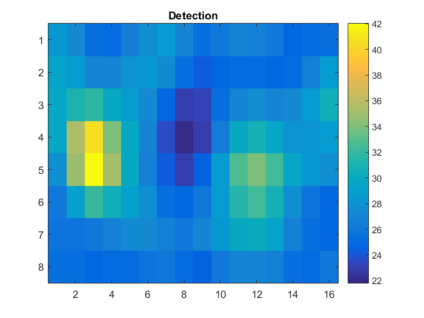
>任务: 计算结果的维数. 然后检查和matlab给出的是否一致.

>问题: 可视化图片并且使用代码获取结果，结果图是否如你所预期的那样?
>
Step 1.5: 提取好的检测

现在模型已经应用到图片上来，并且我们得到了结果图. 为了从这里得到检测的结果，我们(i) 找到最大的响应and (ii) 计算最大最大响应包围框的位置. 最大值是通过找到的:
```matlab
[best, bestIndex] = max(scores(:)) ;
```
注意bestIndex是[1,M]间的线性索引，M是所有滤波器的位置.我们把它转换成二维索引 (hx,hy)使用matlab的ind2sub 函数:
```matlab
[hy, hx] = ind2sub(size(scores), bestIndex) ;
```
(hx,hy) 是HOG单元的位置. 我们还需要把它转换为对应的坐标:
```matlab
x = (hx - 1) * hogCellSize + 1 ;
y = (hy - 1) * hogCellSize + 1 ;
```
>问题: 为什么需要-1和+1? 找到的是HOG cell (hx,hy)单元的哪个像素 (x,y)?
HOG胞元的大小有好几种计算方式，一个简单的方法是:
```matlab
modelWidth = size(trainHog, 2) ;
modelHeight = size(trainHog, 1) ;
```
现在我们有足够的信息来计算包围框了:
```matlab
detection = [
  x - 0.5 ;
  y - 0.5 ;
  x + hogCellSize * modelWidth - 0.5 ;
  y + hogCellSize * modelHeight - 0.5 ;] ;
```
注意：像素是整数的，像素的边界至少有距离 ±1/2.
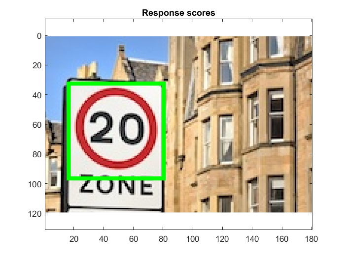
>问题: 使用上面的代码画出检测中的包围框，它是否如你所愿?
Part 2: 使用SVM的多尺度检测

在第二部分，我们将会: (i) 把检测器扩展到多尺度搜索 (ii) 使用支持向量机学习一个更好的模型. 我们首先加载所需的数据:
```matlab
setup ;
targetClass = 'mandatory' ;
loadData(targetClass) ;
```
mandatory类似所有信号里比较简单的一个。

Step 2.1: 多尺度检测

O目标存在于不同于模板的许多尺度中. 为了找到所有的目标，我们缩放图片并且不断的在上面搜索.

搜索的尺度定义如下:
```matlab
% Scale space configuraiton
minScale = -1 ;
maxScale = 3 ;
numOctaveSubdivisions = 3 ;
scales = 2.^linspace(...
  minScale,...
  maxScale,...
  numOctaveSubdivisions*(maxScale-minScale+1)) ;
```
给定如第一部分所述的模型w, 我们上海移动 detectAtMultipleScales函数来在多尺度检索:
```matlab
detection = detectAtMultipleScales(im, w, hogCellSize, scales) ;
```
注意这个函数会随着运行产生不同的图。因此如果你不想让当前图片被删除的话，给它一个新的索引.
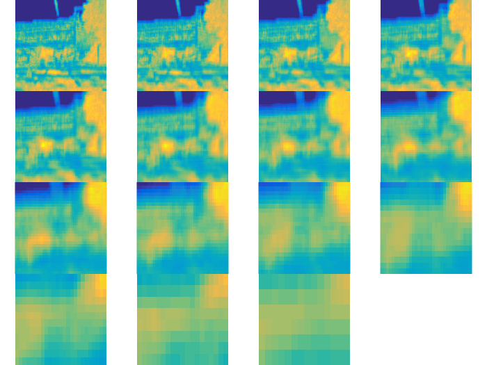
>问题: 打开并学习detectAtMultipleScales函数.确保和之前的代码组偶的工作一样，只是把测试图片缩放了很多次.

>问题: 使用提供的代码可视化检测的结果，它工作的好吗? 如果不好的话，你能想出为什么吗?
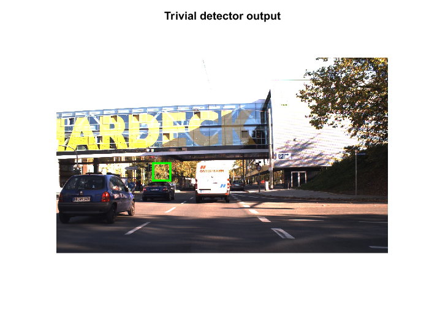
>问题: 观察代码产生的结果.他们能解释的通吗? 有什么地方错了吗?

Step 2.2: 收集正负训练样本

刚才学习到的模型很难工作的很好. 是时候使用SVM来学习一个更好的模型了.为了实现这个目的，我们需要准备一些数据. 我们已经有一些正样本了s (从目标块提取的特征):
```matlab
% Collect positive training data
pos = trainHog ;
```
为了收集负样本，我们在训练图片中遍历，并且均匀的采样:

>任务: 确保你已经理解example2.m 代码.

>问题: 我们收集了多少负样本?
200
Step 2.3: 使用SVM学习一个模型

既然我们已经有了数据，就可以使用SVM学习模型了.在这里我们使用vl_svmtrain函数. 这个函数需要数据是D×N的矩阵, 其中D是特征的维数，N训练样本的个数. 可以这么做:
```matlab
% Pack the data into a matrix with one datum per column
x = cat(4, pos, neg) ;
x = reshape(x, [], numPos + numNeg) ;
```
我们还需要一个二值标签的向量，正样本是+1，负样本是-1:
```matlab
% Create a vector of binary labels
y = [ones(1, size(pos,4)) -ones(1, size(neg,4))] ;
```
最后，我们需要设置SVM的λ参数.由于在后面我们会解释它，这里我们使用C参数代替:
```matlab
numPos = size(pos,4) ;
numNeg = size(neg,4) ;
C = 10 ;
lambda = 1 / (C * (numPos + numNeg)) ;
```
只需一行代码就能完成SVM的学习:
```matlab
% Learn the SVM using an SVM solver
w = vl_svmtrain(x,y,lambda,'epsilon',0.01,'verbose') ;
```
>问题: 使用提供的代码可视化模型w. 它和我们之前学到的模型是否不同? 体现在哪里?
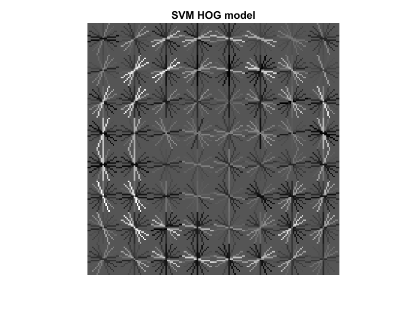
Step 2.4: 评估学习到的模型

使用上面提到的detectAtMultipleScales来评估新学习到的模型.

>问题: 学习到的模型比原始的平均要好吗?
是。
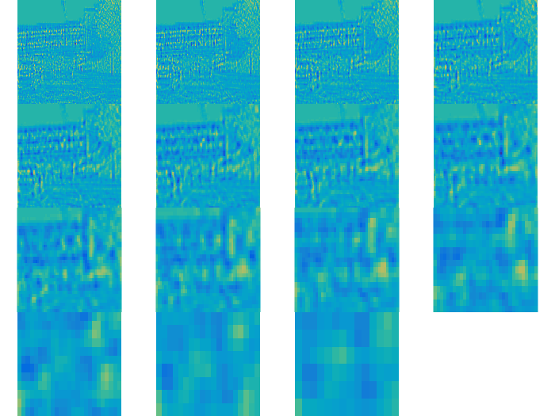
>任务: 试下不同的图片.这个分类器总能在所有的实验中表现很好吗 ?如果不是的话，你看到了什么类型的错误 ? 这些错误可以理解吗?
不是。错误不可理喻

Part 3: 多目标检测和评估

Step 3.1: 多目标检测

只是在多尺度上检测还是不足的: 我们还需要检测那些图片中出现的多于一个的物体.为了实现这个工作，包里还有一个合适的检测函数。这个函数和 detectAtMultipleScales类似, 但是它返回前1000个响应而不是一个:
```matlab
% Compute detections
[detections, scores] = detect(im, w, hogCellSize, scales) ;
```
>任务: 打开并学习detect.m. 确保你已经理解它是怎样工作的.

>问题: 为什么需要返回这么多响应?在实践中，给定的图片不大可能包含这么多物体…
误检可以通过非极大值压缩抑制，但一旦漏检，就再也不可能找回来了。

单个检测子很容易在目标位置附近产生很多的响应，为了消除这些冗余的检测，我们使用非极大值抑制算法. 这是通过boxsuppress.m实现的. 这个算法很简单: 从最大响应位置开始, 然后移除那些重叠率大于一定阈值的响应.这个函数返回一个二值的向量指示是否应该保留检测的值:
```matlab
% Non-maximum suppression
keep = boxsuppress(detections, scores, 0.25) ;

detections = detections(:, keep) ;
scores = scores(keep) ;
```
为了高效起见，在非极大值抑制之后，我们只保留响应最大的10个值:
```matlab
% Further keep only top detections
detections = detections(:, 1:10) ;
scores = scores(1:10) ;
```
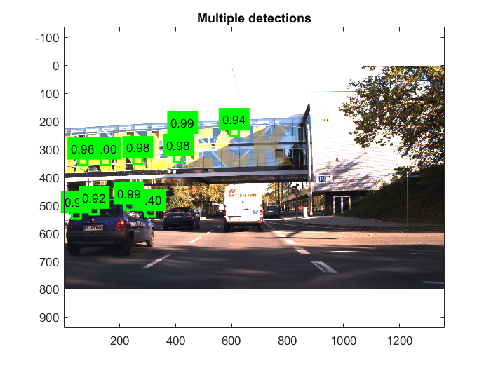
Step 3.2: 检测评估

现在需要审慎的评估我们的检测器了. 我们使用 PASCAL VOC 准则, 计算平均精度(AP). 考虑包含了一系列真值的图片(g1,…,gm)以及候选的检测列表(b1,s1),…,(bn,sn)，值为si. 下面的算法把这些数据转换成一个由T标签和分数组成的列表(si,yi) ，它可以用来计算精度-回召曲线,例如使用VLFeat的 vl_pr函数. 这个算法在evalDetections.m中实现, 如下所示:
```matlab
Assign each candidate detection (bi,si) a true or false label yi∈{+1,−1}. To do so: 
The candidate detections (bi,si) are sorted by decreasing score si.
For each candidate detection in order: 
a. If there is a matching ground truth detection gj (overlap(bi,gj) larger than 50%), the candidate detection is considered positive (yi=+1). Furthermore, the ground truth detection is removed from the list and not considered further. 
b. Otherwise, the candidate detection is negative (yi=−1).
Add each ground truth object gi that is still unassigned to the list of candidates as pair (gj,−∞) with label yj=+1.
The overlap metric used to compare a candidate detection to a ground truth bounding box is defined as the ratio of the area of the intersection over the area of the union of the two bounding boxes: 
overlap(A,B)=|A∩B||A∪B|.
```
>问题:
为什么匹配后的真值在列表中要删除?
如果一个物体被检测两次会发生什么?
你能解释下为怎么没有匹配真值给值−∞吗?
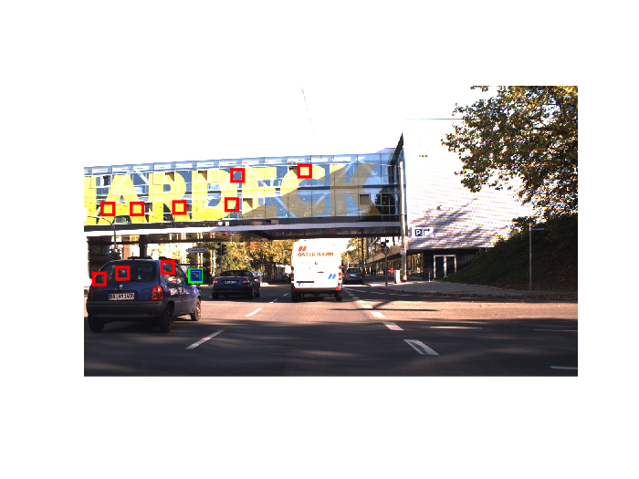
为了使用这个算法，我们首先需要找到测试图片的真值:
```matlab
% Find all the objects in the target image
s = find(strcmp(testImages{1}, testBoxImages)) ;
gtBoxes = testBoxes(:, s) ;
```
然后可以计算 evalDetections :
```matlab
% No example is considered difficult
gtDifficult = false(1, numel(s)) ;

% PASCAL-like evaluation
matches = evalDetections(...
  gtBoxes, gtDifficult, ...
  detections, scores) ;
```
gtDifficult可以标识一些很难的需要忽略的真值.它在 PASCAL VOC 挑战中被使用, 但是我们这里没有考虑它.

evalDetections 返回匹配的一系列结构.在这里我们关注matches.detBoxFlags:正确的检测为+1 否则为-1 . 我们还使用它来可视化检测的误差:
```matlab
% Visualization
figure(1) ; clf ;
imagesc(im) ; axis equal ; hold on ;
vl_plotbox(detections(:, matches.detBoxFlags==+1), 'g', 'linewidth', 2) ;
vl_plotbox(detections(:, matches.detBoxFlags==-1), 'r', 'linewidth', 2) ;
vl_plotbox(gtBoxes, 'b', 'linewidth', 1) ;
axis off ;
```
>任务:使用提供的代码评估一幅图片们确保你已经理解输出.
现在画出PR曲线:
```matlab
figure(2) ; clf ;
vl_pr(matches.labels, matches.scores) ;
```
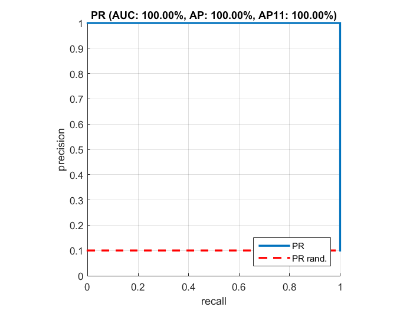
>问题:在每幅图片中有很多的错误. 你应该为此担心吗? PR曲线是怎么被影响的?在实践中为了减少这些影响你会怎么做?
Step 3.3: 评估多目标检测

评估是在多福图片而不是一幅图片就完事了，这是通过evalModel.m实现的

>任务: 打开evalModel.m并确保你已经理解评估的主要过程.
使用提供的代码在这个测试集上运行评估，并获得结果:
```matlab
matches = evaluateModel(testImages, testBoxes, testBoxImages, ...
  w, hogCellSize, scales) ;
```
>注意: 这个函数处理每张图片都需要很长的时间，并且随着进度可视化结果.PR曲线是到目前为止获得的结果.

任务Task: 打开evaluateModel.m文件，并在循环的最后设置一个断点. 现在重新运行评估的代码并且单独观察每张图片的结果. 检查哪些正确和错误的匹配以及它们的排名和累积PR曲线的影响.
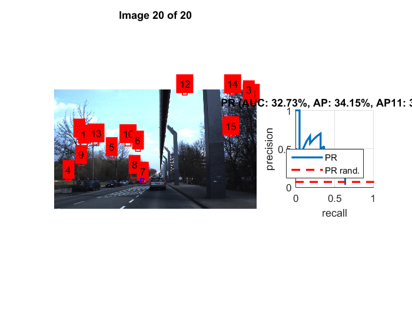
Part 4: 难例挖掘

这部分探索更高级的技术T. 现在，SVM学习的模型已经使用了小的以及随机的样本. 然而，在实践中，每个不包含物体的单独的块都可以认为是负样本. 在实际中这么做的话会有很大的风险，不幸的是，随机采样和大多数感兴趣的物体都很小并且只有很少的负样本.

难例挖掘是发现关键的负样本的简单的技术. 想法很简单：我们首先不使用任何负样本（在这里称为一类SVM） , 然后把拿下错误的检测作为负样本加入到训练集中。

Step 4.1: 使用难例训练

使用example4.m提供的代码来进行难例挖掘. 这个代码不断的运行SVM的训练好多次，逐渐的提高难例数组的大小。这是使用下面的代码完成的:
```matlab
 [matches, moreNeg] = ...
    evaluateModel(...
    vl_colsubset(trainImages', schedule(t), 'beginning'), ...
    trainBoxes, trainBoxImages, ...
    w, hogCellSize, scales) ;
```
这里moreNeg包含了最高的最易混淆的样本.
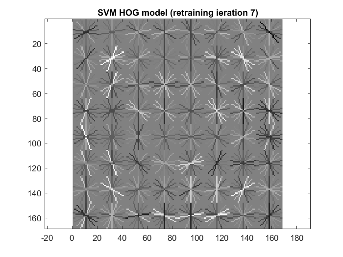
>任务:重新检查evaluateModel.m并理解难例是怎样被发掘出来的.

>问题: vl_colsubset(trainImages', schedule(t), 'beginning')的作用是什么? 你认为为什么我们需要在后面的迭代中使用更多的负样本?
下一步是把新的负样本和已有的融合：
```matlab
% Add negatives
neg = cat(4, neg, moreNeg) ;
```
注意难例挖掘可能在不同的迭代过程中选择同样的样本，下面的代码旨在消除这些冗余:
```matlab
% Remove negative duplicates
z = reshape(neg, [], size(neg,4)) ;
[~,keep] = unique(z','stable','rows') ;
neg = neg(:,:,:,keep) ;
```
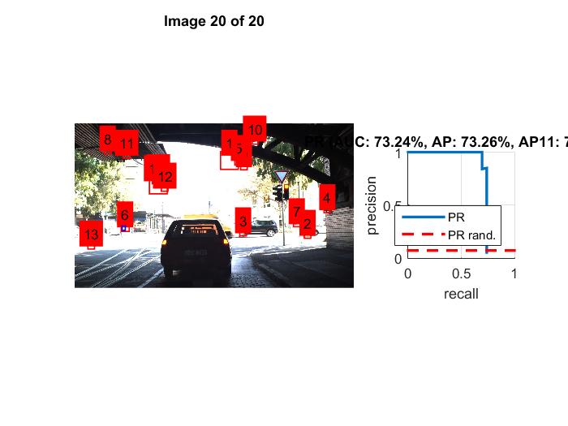
Step 4.2: 在测试数据上评估

一旦难例挖掘和训练过程结果，我们就可以在测试数据上评估得到的模型了，如前所述:
```matlab
evaluateModel(...
    testImages, testBoxes, testBoxImages, ...
    w, hogCellSize, scales) ;
```
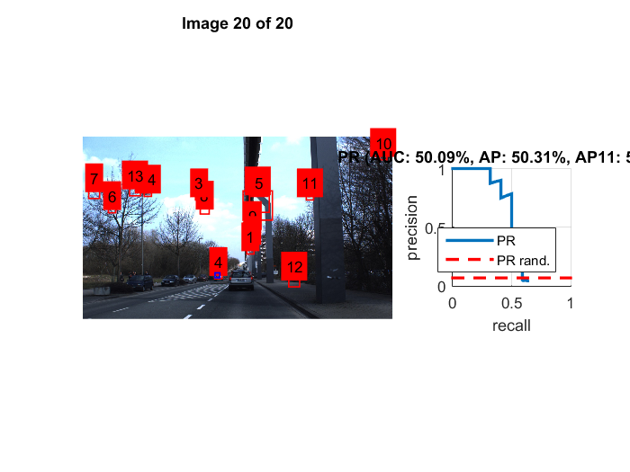
Part 5: 训练自己的检测器

快速学习的话可以跳过

在最后一部分，你讲学习怎么训练自己的目标检测器。打开exercise5.m. 你需要准备如下的数据:

Step 5.1: 准备训练数据

data/myPositives文件夹包含文件image1.jpeg, image2.jpeg, …, 每个图片都是目标的裁剪. 这些图片可以使任意大小，但必须是方形的.
data/myNegatives文件夹下包含文件image1.jpeg, image2.jpeg, …, 不应该含有任何目标.
测试图片data/myTestImage.jpeg包含目标物体. 它不应该是训练集中的图片.
运行example5.m 来检查你的训练数据看起来是否正确.

>任务:理解这个检测器的缺陷所在，选择那些更容易学习的目标.
Hint:特别注意那些类似的和对齐的目标. 如果你的目标不是对称的话，选择特定方向的图片 (例如头朝向左的马).

Step 5.2: 学习模型

使用example5.m 利用难例挖掘来学习一个SVM模型。

Step 5.3: 测试模型

使用example5.m来评估得到的模型

>任务:确保你已经得到可以理解的结果. 如果需要的话跳回2.1重新准备你的数据.
Hint: 如果需要调试的话，使用训练集的图片作为测试集，看下这种情况下它是否好转？?

Step 5.4: 检测多个角度的对称物体

你学习到的检测器还不能处理诸如变形、平面外旋转、部分遮挡等自然场景物体通常的挑战. 处理这些影响需要更复杂的模型，包括变形图匹配以及使用多个模型混合.

特别的，在自然中，有很多对称的物体，并且这些图片看起来好像是左右翻转了（例如人脸）. 这可以通过对称HOG模板来处理，在这部分我们将探索这个选择.

>任务:使用上面的处理过程训练特定朝向的物体，例如训练一个检测左朝向马的检测器 .

>任务: 收集包含两个朝向的测试图片。运行你的检测器并且确保他只在训练的方向上工作.
HOG特征有良好的结构使得它能够预测图片翻转的情形.对于给定的胞元，HOG有31个维度. 下面的代码在垂直轴上翻转胞元:
```matlab
perm = vl_hog('permutation') ;
hog_flipped = hog(perm) ;
```
注意这个干扰只是用到了单个的HOG胞元上。但是，模板是胞元组成的H×W×31维度的数组.

>任务: 给定H×W×31维度大小的数组, 编写matlab代码获得翻转后的特征hog_flipped.
Hint: 回一下第一维是垂直坐标，第二维是水平坐标，第三维是特征通道. perm应该被用于最后一个维度你还需要转置其他的东西吗?

现在让我们把翻转用于训练之前的模型:

>任务:假设 w是你之前训练的模型使用翻转得到的模型为 w_flipped. 然后如1.3那样可视化 w 和w_flipped. 确保你的翻转是成功的.
我们现在有两个模型w and w_flipped, 每个对应物体的一个视角.

>任务: 在同一幅图运行两个模型，得到两个检测结果.找到一种方式来融合着两个列表并且可视化前几个响应. 确保现在你能够检测两个方向的物体.
Hint: 不要忘了可以在两个方向上使用非极大值抑制.

恭喜你完成整个教程!

History

Used in the Oxford AIMS CDT, 2014-15
This is part of the MatConvNet toolbox for convolutional neural networks. Nevertheless, there is no neural network discussed here. ↩